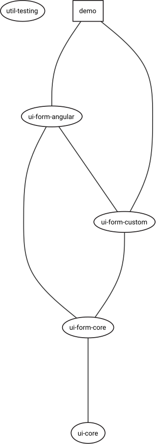

# Nxc

## Prova de conceito

A ideia é usar componentes em diversas plataformas com o mínimo de impacto, tendo apenas uma fonte de verdade para design e comportamento.

## Conceitos

- Web components
- Custom elements
- Custom events
- Mono repositório
- Clean Architecture

## Frameworks & Tools

- TypeScript
- Angular
- StencilJS
- Nx tools

---

## Estrutura

### Diretórios

```
├── ui
│   ├── core
│   ├── form
│   │   ├── angular
│   │   ├── core
│   │   └── custom
│   └── styles
│       ├── core
│       ├── global.scss
│       ├── mixins
│       ├── partials
│       └── tokens
```

<table>
<tr><td>



</td><td style="vertical-align: top">

<div style="height: 40px">
<span style="font-size: 42.6px"> ☜ </span>
<span style="font-size: 32.6px"> Demo </span>
</div>
<div style="height: 160px">

Tipo de projeto: `application`
Framework: `angular`

Serve:
`nx run serve`

Build:
`nx run demo:build --prod`

</div>
<div style="height: 40px">
<span style="font-size: 42.6px"> ☜ </span>
<span style="font-size: 32.6px"> UI Form Angular </span>
</div>
<div style="height: 160px">

Tipo de projeto: `library`
Framework: `angular`

</div>
<div style="height: 40px">
<span style="font-size: 42.6px"> ☜ </span>
<span style="font-size: 32.6px"> UI Form Custom </span>
</div>
<div style="height: 160px">

Tipo de projeto: `library`
Framework: `stenciljs`

Serve:
`nx run ui-form-custom:serve`

Build:
`nx run ui-form-custom:build`

</div>
<div style="height: 40px">
<span style="font-size: 42.6px"> ☜ </span>
<span style="font-size: 32.6px"> UI Form Core </span>
</div>
<div style="height: 160px">

Tipo de projeto: `library`
Framework: `nx workspace`

</div>
<div style="height: 40px">
<span style="font-size: 42.6px"> ☜ </span>
<span style="font-size: 32.6px"> UI Core </span>
</div>
<div>

Tipo de projeto: `library`
Framework: `nx workspace`

</div>
</td></tr>
</table>

---

```elixir
> NX:  Installed plugins:

  @nrwl/jest (builders,schematics)
  @nrwl/angular (builders,schematics)
  @nrwl/cypress (builders,schematics)
  @nrwl/workspace (builders,schematics)
  @nxext/stencil (builders,schematics)
```

```elixir
> NX:  Also available:

  @nrwl/bazel (schematics)
  @nrwl/express (builders,schematics)
  @nrwl/linter (builders)
  @nrwl/nest (builders,schematics)
  @nrwl/next (builders,schematics)
  @nrwl/node (builders,schematics)
  @nrwl/nx-plugin (builders,schematics)
  @nrwl/react (builders,schematics)
  @nrwl/storybook (builders,schematics)
  @nrwl/web (builders,schematics)
```

There are also many [community plugins](https://nx.dev/nx-community) you could add.

## Development

Run `nx serve my-app` for a dev server. Navigate to http://localhost:4200/. The app will automatically reload if you change any of the source files.

## Build

1. Custom elements
   Run `nx build my-app` to build the project. The build artifacts will be stored in the `dist/` directory. Use the `--prod` flag for a production build.

## Running unit tests

Run `nx test my-app` to execute the unit tests via [Jest](https://jestjs.io).

Run `nx affected:test` to execute the unit tests affected by a change.

## Running end-to-end tests

Run `ng e2e my-app` to execute the end-to-end tests via [Cypress](https://www.cypress.io).

Run `nx affected:e2e` to execute the end-to-end tests affected by a change.

## Understand your workspace

Run `nx dep-graph` to see a diagram of the dependencies of your projects.

## Further help

Visit the [Nx Documentation](https://nx.dev) to learn more.

## ☁ Nx Cloud

### Computation Memoization in the Cloud

<p align="center"></p>

Nx Cloud pairs with Nx in order to enable you to build and test code more rapidly, by up to 10 times. Even teams that are new to Nx can connect to Nx Cloud and start saving time instantly.

Teams using Nx gain the advantage of building full-stack applications with their preferred framework alongside Nx’s advanced code generation and project dependency graph, plus a unified experience for both frontend and backend developers.

Visit [Nx Cloud](https://nx.app/) to learn more.
