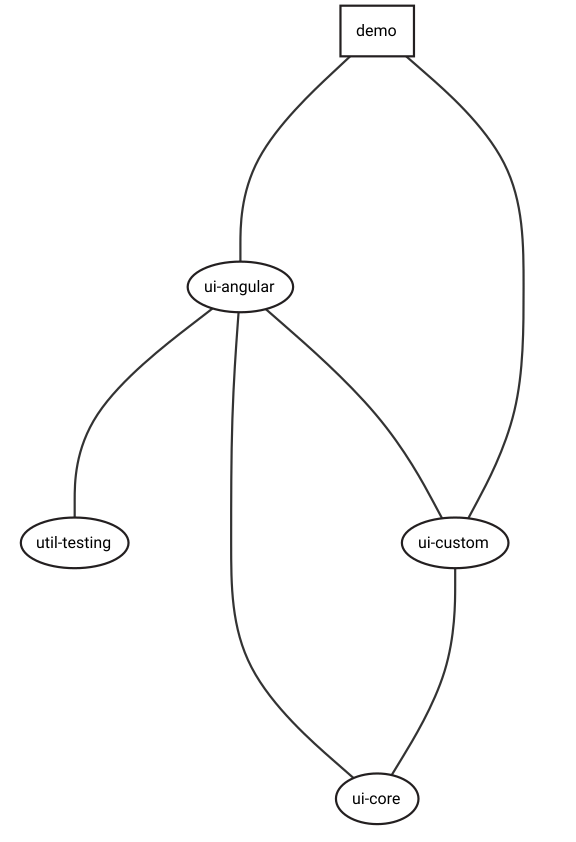

<h1>UI</h1>

Diretório de agrupamento para bibliotecas de interface do usuário.


## Estrutura

### Diretórios

```
├── ui
│   ├── core
│   ├── form
│   │   ├── angular
│   │   ├── core
│   │   └── custom
│   └── styles
│       ├── core
│       ├── global.scss
│       ├── mixins
│       ├── partials
│       └── tokens
```

key | value
--- | ---
Tags: | `type:ui`
Prefixo | `ui`

<h3>Gráfico de dependência</h3>

<figure>
  
</figure>
