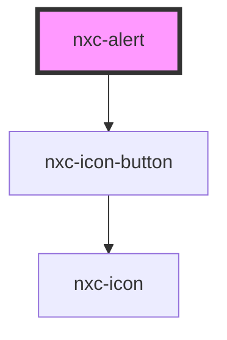

# nxc-alert

<!-- Auto Generated Below -->

## Properties

| Property   | Attribute  | Description | Type                                                        | Default     |
| ---------- | ---------- | ----------- | ----------------------------------------------------------- | ----------- |
| `closable` | `closable` |             | `boolean`                                                   | `false`     |
| `open`     | `open`     |             | `boolean`                                                   | `false`     |
| `type`     | `type`     |             | `"danger" \| "info" \| "primary" \| "success" \| "warning"` | `'primary'` |

## Events

| Event          | Description | Type               |
| -------------- | ----------- | ------------------ |
| `nxcAfterHide` |             | `CustomEvent<any>` |
| `nxcAfterShow` |             | `CustomEvent<any>` |
| `nxcHide`      |             | `CustomEvent<any>` |
| `nxcShow`      |             | `CustomEvent<any>` |

## Methods

### `hide() => Promise<boolean>`

#### Returns

Type: `Promise<boolean>`

### `show() => Promise<boolean>`

#### Returns

Type: `Promise<boolean>`

## Shadow Parts

| Part             | Description |
| ---------------- | ----------- |
| `"base"`         |             |
| `"close-button"` |             |
| `"icon"`         |             |
| `"message"`      |             |

## Dependencies

### Depends on

- [nxc-icon-button](../nxc-icon-button)

### Graph

----------------------------------------------

*Built with [StencilJS](https://stenciljs.com/)*
