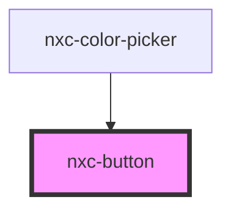

# nxc-button

<!-- Auto Generated Below -->

## Properties

| Property   | Attribute  | Description | Type                                                                               | Default     |
| ---------- | ---------- | ----------- | ---------------------------------------------------------------------------------- | ----------- |
| `caret`    | `caret`    |             | `boolean`                                                                          | `undefined` |
| `circle`   | `circle`   |             | `boolean`                                                                          | `undefined` |
| `disabled` | `disabled` |             | `boolean`                                                                          | `undefined` |
| `loading`  | `loading`  |             | `boolean`                                                                          | `undefined` |
| `name`     | `name`     |             | `string`                                                                           | `undefined` |
| `pill`     | `pill`     |             | `boolean`                                                                          | `undefined` |
| `size`     | `size`     |             | `"large" \| "medium" \| "small"`                                                   | `'medium'`  |
| `submit`   | `submit`   |             | `boolean`                                                                          | `undefined` |
| `type`     | `type`     |             | `"danger" \| "default" \| "info" \| "primary" \| "success" \| "text" \| "warning"` | `'default'` |
| `value`    | `value`    |             | `string`                                                                           | `undefined` |

## Events

| Event      | Description | Type               |
| ---------- | ----------- | ------------------ |
| `nxcBlur`  |             | `CustomEvent<any>` |
| `nxcFocus` |             | `CustomEvent<any>` |

## Methods

### `removeFocus() => Promise<void>`

Removes focus from the button.

#### Returns

Type: `Promise<void>`

### `setFocus() => Promise<void>`

Sets focus on the button.

#### Returns

Type: `Promise<void>`

## Shadow Parts

| Part       | Description |
| ---------- | ----------- |
| `"base"`   |             |
| `"caret"`  |             |
| `"label"`  |             |
| `"prefix"` |             |
| `"suffix"` |             |

## Dependencies

### Used by

 - [nxc-color-picker](../nxc-color-picker)

### Graph

----------------------------------------------

*Built with [StencilJS](https://stenciljs.com/)*
