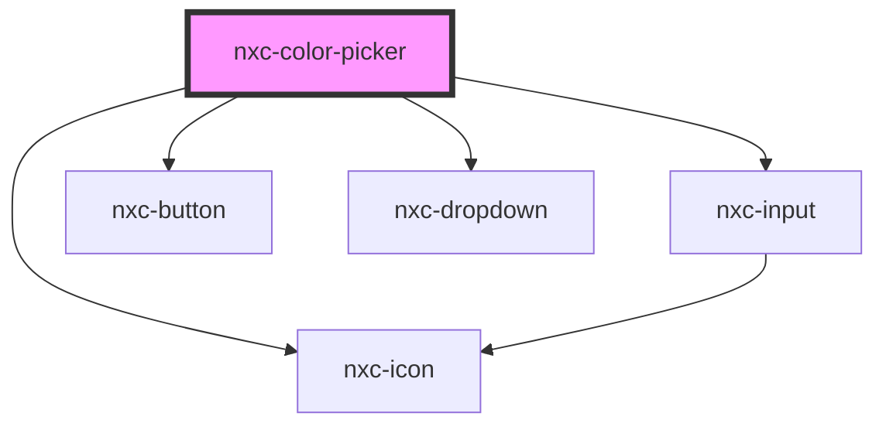

# nxc-color-picker

<!-- Auto Generated Below -->

## Properties

| Property    | Attribute   | Description                                                                                                                                                                                                                                               | Type                             | Default                                                                                                                                                                                                                                 |
| ----------- | ----------- | --------------------------------------------------------------------------------------------------------------------------------------------------------------------------------------------------------------------------------------------------------- | -------------------------------- | --------------------------------------------------------------------------------------------------------------------------------------------------------------------------------------------------------------------------------------- |
| `disabled`  | `disabled`  | Set to true to disable the color picker.                                                                                                                                                                                                                  | `boolean`                        | `false`                                                                                                                                                                                                                                 |
| `format`    | `format`    | The format to use for the display value. If opacity is enabled, these will translate to HEXA, RGBA, and HSLA respectively. The color picker will always accept user input in any format (including CSS color names) and convert it to the desired format. | `"hex" \| "hsl" \| "rgb"`        | `'hex'`                                                                                                                                                                                                                                 |
| `inline`    | `inline`    | Set to true to render the color picker inline rather than inside a dropdown.                                                                                                                                                                              | `boolean`                        | `false`                                                                                                                                                                                                                                 |
| `opacity`   | `opacity`   | Whether to show the opacity slider.                                                                                                                                                                                                                       | `boolean`                        | `false`                                                                                                                                                                                                                                 |
| `size`      | `size`      | When `inline` is true, this determines the size of the color picker's trigger.                                                                                                                                                                            | `"large" \| "medium" \| "small"` | `'medium'`                                                                                                                                                                                                                              |
| `swatches`  | --          | An array of predefined color swatches to display. Can include any format the color picker can parse, including HEX(A), RGB(A), HSL(A), and CSS color names.                                                                                               | `string[]`                       | `[     '#d0021b',     '#f5a623',     '#f8e71c',     '#8b572a',     '#7ed321',     '#417505',     '#bd10e0',     '#9013fe',     '#4a90e2',     '#50e3c2',     '#b8e986',     '#000',     '#444',     '#888',     '#ccc',     '#fff'   ]` |
| `uppercase` | `uppercase` | By default, the value will be set in lowercase. Set this to true to set it in uppercase instead.                                                                                                                                                          | `boolean`                        | `false`                                                                                                                                                                                                                                 |
| `value`     | `value`     | The current color.                                                                                                                                                                                                                                        | `string`                         | `'#ffffff'`                                                                                                                                                                                                                             |

## Events

| Event          | Description                                                                                               | Type               |
| -------------- | --------------------------------------------------------------------------------------------------------- | ------------------ |
| `nxcAfterHide` | Emitted after the color picker closes and all transitions are complete.                                   | `CustomEvent<any>` |
| `nxcAfterShow` | Emitted after the color picker opens and all transitions are complete.                                    | `CustomEvent<any>` |
| `nxcHide`      | Emitted when the color picker closes. Calling `event.preventDefault()` will prevent it from being closed. | `CustomEvent<any>` |
| `nxcShow`      | Emitted when the color picker opens. Calling `event.preventDefault()` will prevent it from being opened.  | `CustomEvent<any>` |
| `valueChange`  | Emitted when the color picker's value changes.                                                            | `CustomEvent<any>` |

## Shadow Parts

| Part              | Description |
| ----------------- | ----------- |
| `"base"`          |             |
| `"copy-button"`   |             |
| `"grid"`          |             |
| `"grid-handle"`   |             |
| `"input"`         |             |
| `"preview"`       |             |
| `"slider"`        |             |
| `"slider-handle"` |             |
| `"swatch"`        |             |
| `"swatches"`      |             |

## CSS Custom Properties

| Name                   | Description                              |
| ---------------------- | ---------------------------------------- |
| `--grid-handle-size`   | The size of the color grid's handle.     |
| `--grid-height`        | The height of the color grid.            |
| `--grid-width`         | The width of the color grid.             |
| `--slider-handle-size` | The diameter of the slider's handle.     |
| `--slider-height`      | The height of the hue and alpha sliders. |

## Dependencies

### Depends on

- [nxc-input](../nxc-input)
- [nxc-button](../nxc-button)
- [nxc-icon](../nxc-icon)
- [nxc-dropdown](../nxc-dropdown)

### Graph

----------------------------------------------

*Built with [StencilJS](https://stenciljs.com/)*
