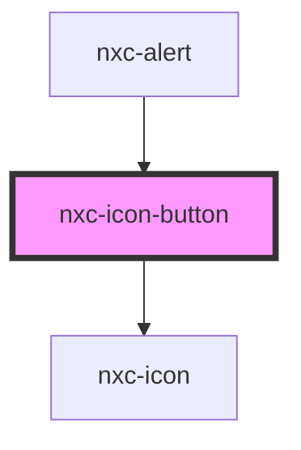

# nxc-icon-button

<!-- Auto Generated Below -->

## Properties

| Property   | Attribute  | Description | Type      | Default     |
| ---------- | ---------- | ----------- | --------- | ----------- |
| `disabled` | `disabled` |             | `boolean` | `false`     |
| `label`    | `label`    |             | `string`  | `undefined` |
| `name`     | `name`     |             | `string`  | `undefined` |
| `src`      | `src`      |             | `string`  | `undefined` |

## Shadow Parts

| Part     | Description |
| -------- | ----------- |
| `"base"` |             |

## Dependencies

### Used by

 - [nxc-alert](../nxc-alert)

### Depends on

- [nxc-icon](../nxc-icon)

### Graph

----------------------------------------------

*Built with [StencilJS](https://stenciljs.com/)*
