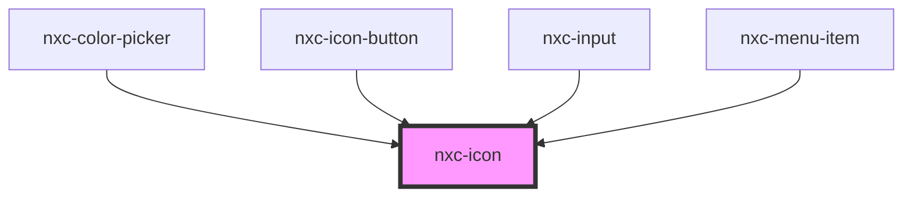

# nxc-icon

<!-- Auto Generated Below -->

## Properties

| Property | Attribute | Description    | Type     | Default     |
| -------- | --------- | -------------- | -------- | ----------- |
| `label`  | `label`   | The icon label | `string` | `undefined` |
| `name`   | `name`    | The icon name  | `string` | `undefined` |
| `src`    | `src`     | The icon path  | `string` | `undefined` |

## Events

| Event      | Description                           | Type               |
| ---------- | ------------------------------------- | ------------------ |
| `nxcError` | Emitted when the icon failed to load. | `CustomEvent<any>` |
| `nxcLoad`  |                                       | `CustomEvent<any>` |

## Shadow Parts

| Part     | Description |
| -------- | ----------- |
| `"base"` |             |

## Dependencies

### Used by

 - [nxc-color-picker](../nxc-color-picker)
 - [nxc-icon-button](../nxc-icon-button)
 - [nxc-input](../nxc-input)
 - [nxc-menu-item](../nxc-menu-item)

### Graph

----------------------------------------------

*Built with [StencilJS](https://stenciljs.com/)*
