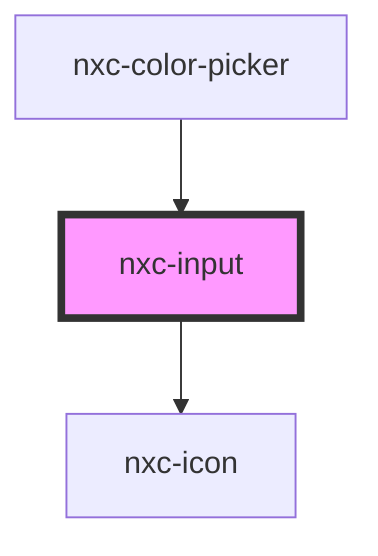

# nxc-input

<!-- Auto Generated Below -->

## Properties

| Property         | Attribute         | Description | Type                             | Default     |
| ---------------- | ----------------- | ----------- | -------------------------------- | ----------- |
| `autofocus`      | `autofocus`       |             | `boolean`                        | `undefined` |
| `clearable`      | `clearable`       |             | `boolean`                        | `false`     |
| `disabled`       | `disabled`        |             | `boolean`                        | `false`     |
| `invalid`        | `invalid`         |             | `boolean`                        | `false`     |
| `label`          | `label`           |             | `string`                         | `''`        |
| `max`            | `max`             |             | `number`                         | `undefined` |
| `maxlength`      | `maxlength`       |             | `number`                         | `undefined` |
| `min`            | `min`             |             | `number`                         | `undefined` |
| `minlength`      | `minlength`       |             | `number`                         | `undefined` |
| `name`           | `name`            |             | `string`                         | `''`        |
| `pattern`        | `pattern`         |             | `string`                         | `undefined` |
| `pill`           | `pill`            |             | `boolean`                        | `false`     |
| `placeholder`    | `placeholder`     |             | `string`                         | `undefined` |
| `readonly`       | `readonly`        |             | `boolean`                        | `false`     |
| `required`       | `required`        |             | `boolean`                        | `undefined` |
| `size`           | `size`            |             | `"large" \| "medium" \| "small"` | `'medium'`  |
| `step`           | `step`            |             | `number`                         | `undefined` |
| `togglePassword` | `toggle-password` |             | `boolean`                        | `false`     |
| `type`           | `type`            |             | `string`                         | `'text'`    |
| `valid`          | `valid`           |             | `boolean`                        | `false`     |
| `value`          | `value`           |             | `string`                         | `''`        |

## Events

| Event         | Description | Type               |
| ------------- | ----------- | ------------------ |
| `blurChange`  |             | `CustomEvent<any>` |
| `focusChange` |             | `CustomEvent<any>` |
| `valueChange` |             | `CustomEvent<any>` |

## Methods

### `removeFocus() => Promise<void>`

Remove o foco do elemento.

#### Returns

Type: `Promise<void>`

### `select() => Promise<void>`

Seleciona todo texto do input.

#### Returns

Type: `Promise<void>`

### `setFocus() => Promise<void>`

Coloca foco no elemento.

#### Returns

Type: `Promise<void>`

## Shadow Parts

| Part                       | Description |
| -------------------------- | ----------- |
| `"base"`                   |             |
| `"clear-button"`           |             |
| `"form-control"`           |             |
| `"help-text"`              |             |
| `"input"`                  |             |
| `"label"`                  |             |
| `"password-toggle-button"` |             |
| `"prefix"`                 |             |
| `"suffix"`                 |             |

## Dependencies

### Used by

 - [nxc-color-picker](../nxc-color-picker)

### Depends on

- [nxc-icon](../nxc-icon)

### Graph

----------------------------------------------

*Built with [StencilJS](https://stenciljs.com/)*
