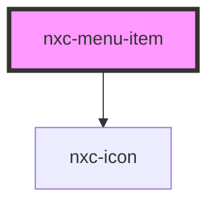

# nxc-menu-item

<!-- Auto Generated Below -->

## Properties

| Property   | Attribute  | Description | Type      | Default |
| ---------- | ---------- | ----------- | --------- | ------- |
| `active`   | `active`   |             | `boolean` | `false` |
| `checked`  | `checked`  |             | `boolean` | `false` |
| `disabled` | `disabled` |             | `boolean` | `false` |
| `value`    | `value`    |             | `string`  | `''`    |

## Shadow Parts

| Part             | Description |
| ---------------- | ----------- |
| `"base"`         |             |
| `"checked-icon"` |             |
| `"label"`        |             |
| `"prefix"`       |             |
| `"suffix"`       |             |

## Dependencies

### Depends on

- [nxc-icon](../nxc-icon)

### Graph

----------------------------------------------

*Built with [StencilJS](https://stenciljs.com/)*
